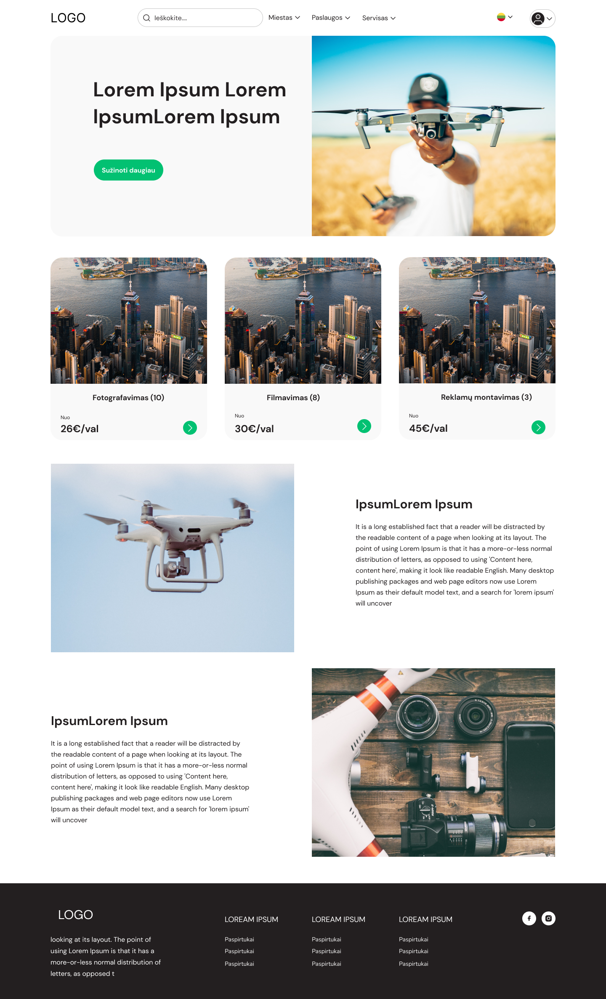

# Drone HUB React App

Hello my name is Paul'ius and this project is meant to showcase my web developement experience. I started from scratch and took a leap of faith that I'm also can learn REACT framework(was tougth ANGULAR before). My aproach was to do and learn things then stuck, as I know that part of web develoeprs job is to find answers online ^^.

### Key points:

- **CRUD**, website or an app with full operations, database and backend Node.js server for user authentification.
- **Routes**
- **Guards**
- **Components**
- **GitHub Issues**
- **Brances**
- **Not** responsive design?
- Design custom made by UX designer [Kestutis Lukosevicius](https://www.linkedin.com/in/kestutis-lukosevicius-459230175/).

### Techniques used:

- **JavaScript** (should go for typeScript)
- **CSS** (need to learn Tailwind and SCSS)
- **HTML**
- **REACT**

[Go Visit my profile and find out more about me](https://github.com/Scarab911)

<!-- [Page hosted on GitHub](https://scarab911.github.io/1-task-game-ui-dom) -->
